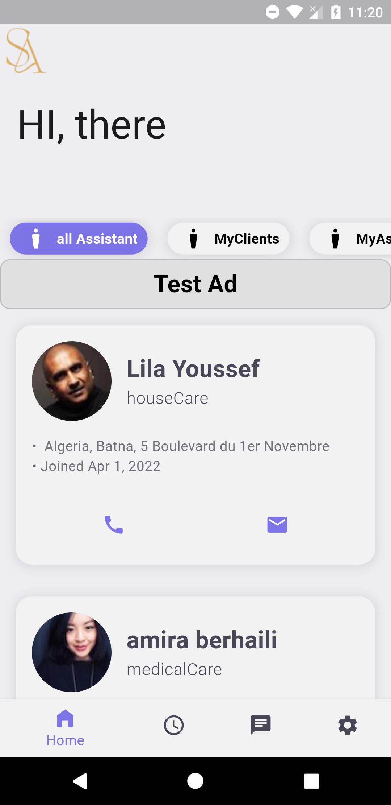
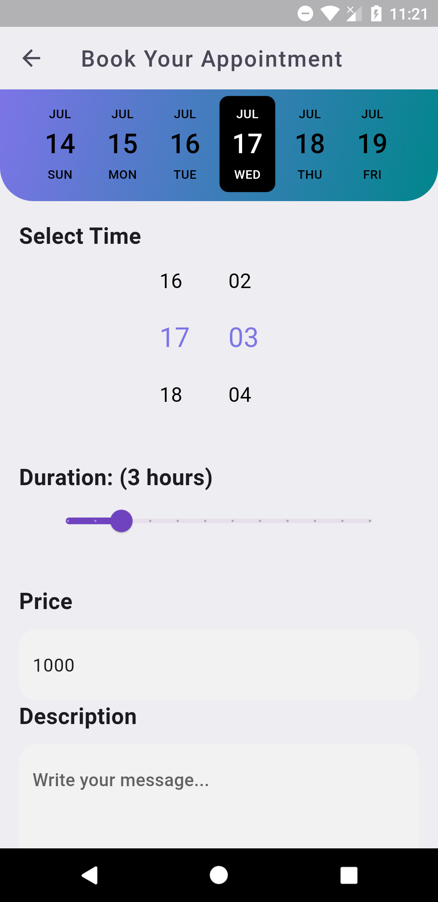
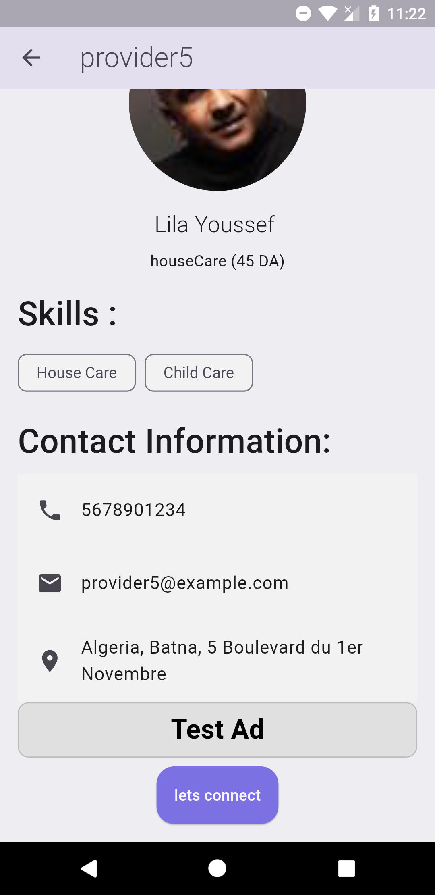
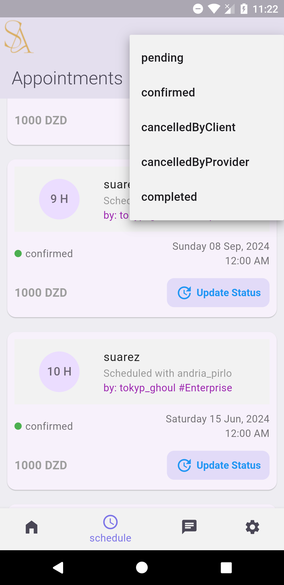
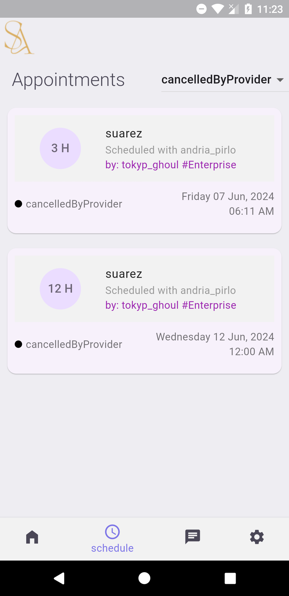
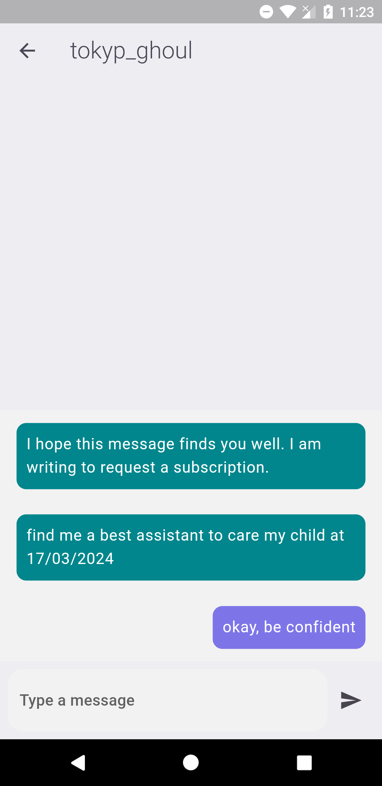
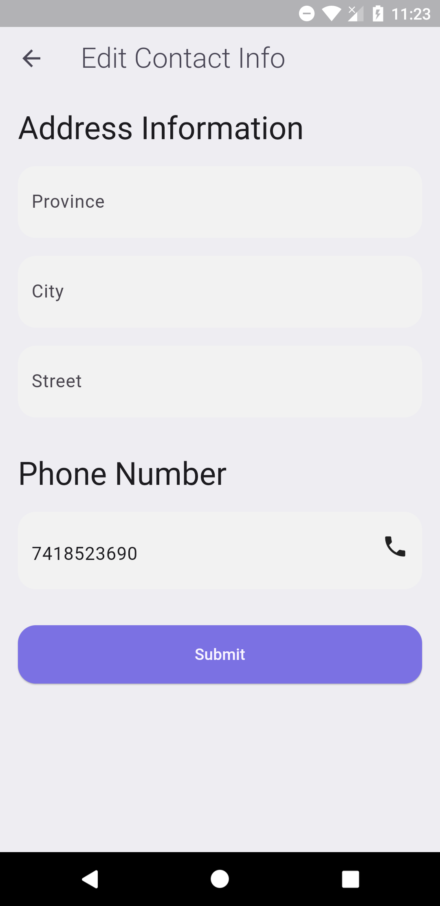
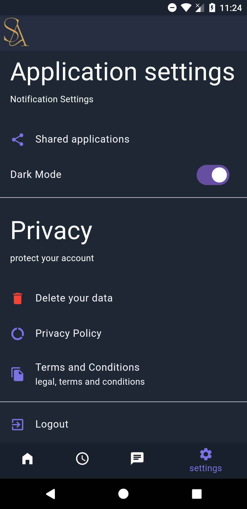
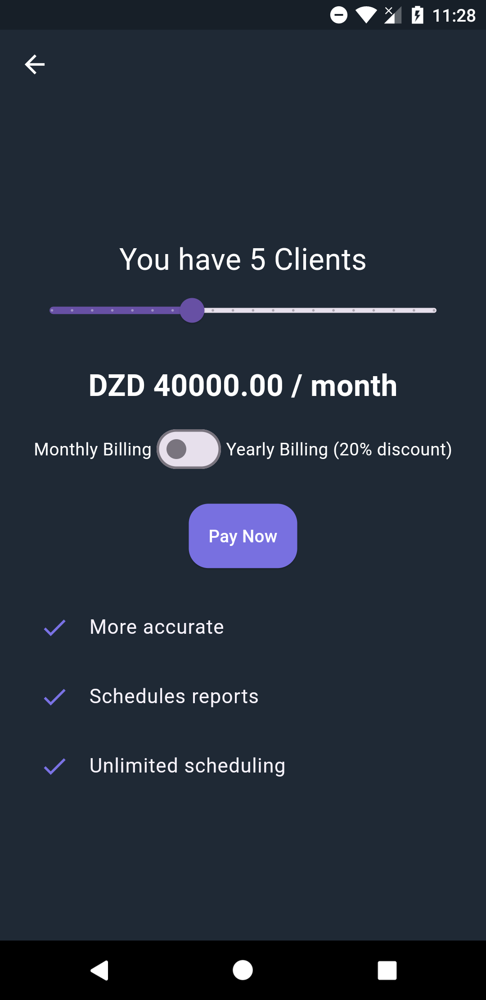
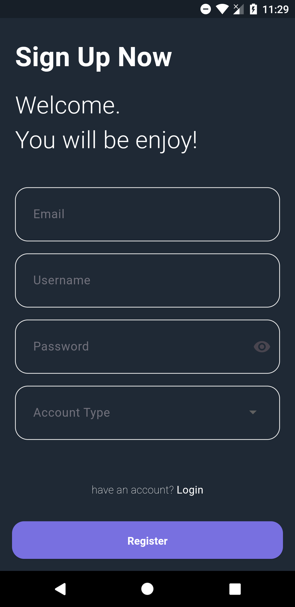

# AssistantsApp

AssistantsApp is a revolutionary Android application built with Flutter designed to bridge clients and service providers, simplifying the process of finding, booking, and managing a wide range of services. From healthcare to home cleaning, AssistantsApp makes it easy to connect with trusted professionals and stay organized.

## Table of Contents
- [Who Benefits](#who-benefits)
- [Key Features](#key-features)
- [Enhanced User Experience](#enhanced-user-experience)
- [Powerful Libraries](#powerful-libraries)
- [Firebase Libraries](#firebase-libraries)
- [Architecture](#architecture)

---

## Who Benefits

### Clients
- **Effortless Booking**: Quickly find and book reliable service providers for babysitting, healthcare, elder care, home cleaning, and more.
- **In-App Communication**: Message service providers directly in the app to discuss details and ensure smooth service.
- **Notifications & Reminders**: Receive timely updates and reminders for your appointments.
- **Diverse Services**: Browse through various service categories to find the perfect assistant for your needs.

### Service Providers
- **Efficient Scheduling**: Manage your client appointments and daily schedule seamlessly.
- **Direct Client Communication**: Use secure in-app messaging to communicate with clients about service details and changes.
- **Increase Visibility**: Enhance your profile’s reach and attract more clients looking for specific services.

### Enterprises
- **Centralized Management**: Set up a business account to coordinate appointments between clients and employees.
- **Simplified Scheduling**: Streamline scheduling processes to improve service consistency and client satisfaction.
- **Enhanced Coordination**: Manage client and employee schedules from a single account for optimal organization.

---

## Key Features

- **Appointment Booking**: A streamlined system for clients to book appointments and for providers to manage them.
- **In-App Messaging**: Secure, private messaging to ensure clear communication between clients and providers.
- **Notifications**: Stay informed with reminders and updates about upcoming appointments.
- **Service Discovery**: Explore various service categories to find the ideal assistant.
- **Enterprise Management**: Special accounts for businesses to handle scheduling between clients and employees.
- **Dark and Light Mode**: Choose between a classic light theme or a battery-saving dark theme to personalize your experience.

---

## Enhanced User Experience

- **Messaging**: Communicate directly within the app to make coordination simple.
- **Quick Appointment Booking**: Find a service provider, select a time, and book quickly to suit your schedule.
- **Find the Right Assistant**: Use search and filters to identify the ideal service provider for your specific needs.

---

## Powerful Libraries

AssistantsApp leverages a range of powerful Flutter libraries to provide a seamless, responsive, and globalized experience:

- **Provider**: Manages app state efficiently across the app.
- **SharedPreferences**: Stores user preferences securely on the device for a customized experience.
- **easy_localization**: Simplifies localization to reach a global audience.
- **url_launcher**: Provides seamless navigation to external links when needed.
- **image_picker**: Allows users to select images from their gallery or camera for profile and other media needs.
- **date_picker_timeline**: Integrates an intuitive, timeline-based date picker for scheduling appointments.
- **flutter_time_picker_spinner**: Lets users pick appointment times with an intuitive, easy-to-use spinner interface.

---

## Firebase Libraries

To enhance data management, real-time communication, and secure authentication, AssistantsApp uses the following Firebase libraries:

- **firebase_auth**: Manages user authentication with options like email, phone, and social sign-in.
- **cloud_firestore**: Stores and syncs data in real-time, ensuring quick access to client and provider data.
- **firebase_messaging**: Enables push notifications to keep users informed of important updates and reminders.
- **firebase_storage**: Efficiently handles media storage and retrieval, ideal for user profile images and other media.
- **firebase_analytics**: Tracks user interactions and app performance, offering insights for continuous improvement.

---

## Architecture

AssistantsApp is built following the **Model-View-Controller (MVC)** architecture, providing a scalable, organized, and maintainable codebase.

- **Model**: Manages all app data, from user profiles to appointment details, synced with Firebase for real-time updates.
- **View**: Handles the app's UI, presenting a user-friendly interface for managing services, appointments, and messages.
- **Controller**: Manages logic between the Model and View, handling user input, data processing, and ensuring a smooth user experience.

By implementing the MVC pattern, AssistantsApp maintains a clear structure, improving code readability and simplifying future updates and maintenance.

---

## App Screenshots

